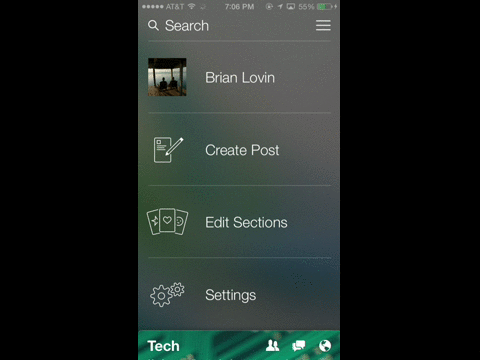

Rubber
======

a beautiful rubber-banding(Transition effect) of list items, like Paper iOS Application.

Requirements
----------
* iOS 6.0 or higher
* ARC

## License
Rubber is released under the MIT license. See
[LICENSE](https://github.com/iSame7/Rubber/blob/master/LICENSE).

Contact
----------

Sameh Mabrouk
  
[http://samehmabrouk.comyr.com][1]

[mabrouksameh@gmail.com][2]

[@same7mabrouk][3] 

  [1]: http://samehmabrouk.comyr.com
  [2]: mailto:mabrouksameh@gmail.com
  [3]: http://twitter.com/same7mabrouk
